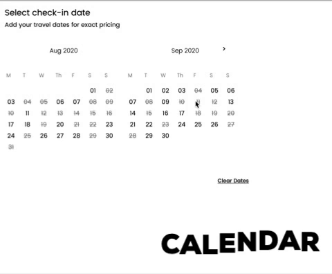
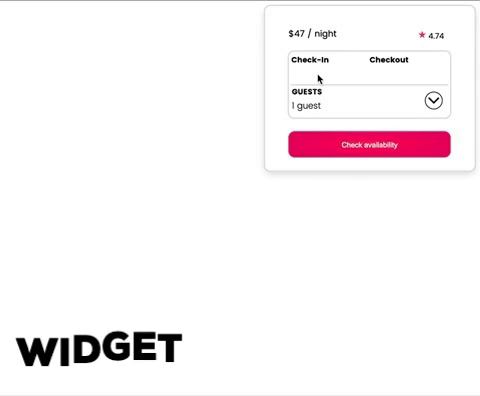

# Reservation

> Reservation is one of many microservices for our Airbnb clone "Airbrb".

`This service is composed of a multiple tools to allow the user to interact with the avaiable dates for a listing and obtain a complete itemized breakdown of their expenses before ever hitting the cart.  There are three parts to the service and each can be animated and displayed for the user at different points of the user's journy while they look into the listing's details.`



> The calendar provides users the ability to check out available dates and make a selection for their stay



> The widget is a compact and easily sticky animated tool that follows the user through the page.  It comes with a calendar for selection and a guest picker to choose how many will be attending the stay


> The mini keeps track off the currently selected stay's price per night, average reviews and provides a button to return to the widget for checkout.  

## Related Projects

- https://github.com/Wilberg-Airbnb/reviews
- https://github.com/Wilberg-Airbnb/description
- https://github.com/Wilberg-Airbnb/location
- https://github.com/Wilberg-Airbnb/sam-johnson-proxy

## Table of Contents

1. [Usage](#Usage)
2. [Requirements](#requirements)
3. [Development](#development)

## Requirements

An `nvmrc` file is included if using [nvm](https://github.com/creationix/nvm).

- Node 6.13.0
- mysql ^2.18.1
- React ^16.13.1
- Webpack ^4.43.0
- Nodemon ^2.0.4

## Development

### Installing Dependencies

From within the root directory:

```sh
npm install -g webpack
npm install
```

### MYSQL setup

Reservation uses MySQL 8 and comes with a schema file.  Please load the schema.sql file in the server directory to build database and required tables.  To execute file:

mysql -u root < server/schema.sql

- In the db directory there is an already provided source of dummy data.
- To seed database, please add schema.sql file via MySQL & update createConnection to match your login in the db/index.js file.
  - Once the schema has been loaded and connection made, you can run 'npm run seed' to seed your new airbrbRes database with example data.
  - If you for any reason want to generate your own randomized data, then you can run 'npm run generator' before seeding.

### Usage

- Please run 'npm run server:dev' to serve application on localhost:5000.
- bundle will serve on http://localhost:5000/public/bundle.js.
- during development, use 'npm run react:dev' to transpile and watch any jsx development.
- 'test' and 'test:watch' scripts are available for unit testing suites and testing coverage reports with Jest.
- To retrieve reservation data for listing, use endpoint http://localhost:5000/api/reservation/:listingId.
- The app also requires an Average Reviews endpoint that is already integrated.  All API calls are pointed to their currently deployed micro services on AWS EC2.

## Deployment with docker

- Reservation contains a Dockerfile & docker-compose.yml file for building docker images of both the application and database.  Simply run docker compose-up in the root directory to build these images to make Reservation deployment-ready.